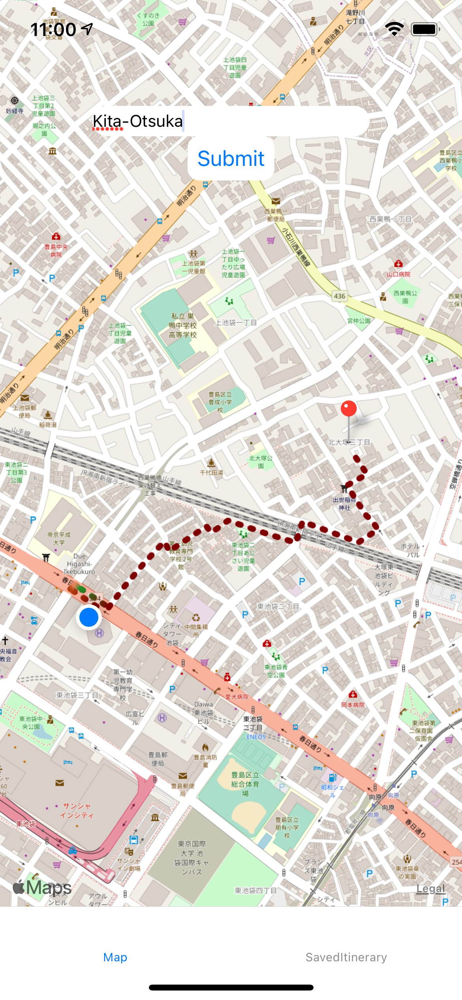

# peaceful_map

# 🛠 WORK IN PROGRESS 🛠 

## Introduction

Where most GPS maps will find you the easiest and the fastest way to go from point A to point B, peaceful map will provide you with some ways to do the same but only taking small streets/roads, allowing you to avoid the hassle of taking noisy and overwhelming big roads.  

Taking small streets/roads is also an incredible way to travel close to your accomodation, discover hidden things you would never have noticed if you had taken that so convenient but noisy main street. 

## Motivation 

As a fan of long walks in Tokyo's charming small streets, I want a tool that would provide me with some good itineraries, but without taking main streets as most applications already do. I prefer long walks to be relaxing and calm moments when I can meditate and think about my projects.

I also have a keen interest in learning more about pathfinding algorithms especially Dijkstra's and A* algorithms, so I decided to take on the challenge and make a mobile application that my surroundings and I would use during our week-ends out.

## Screenshot (current state of the application)

